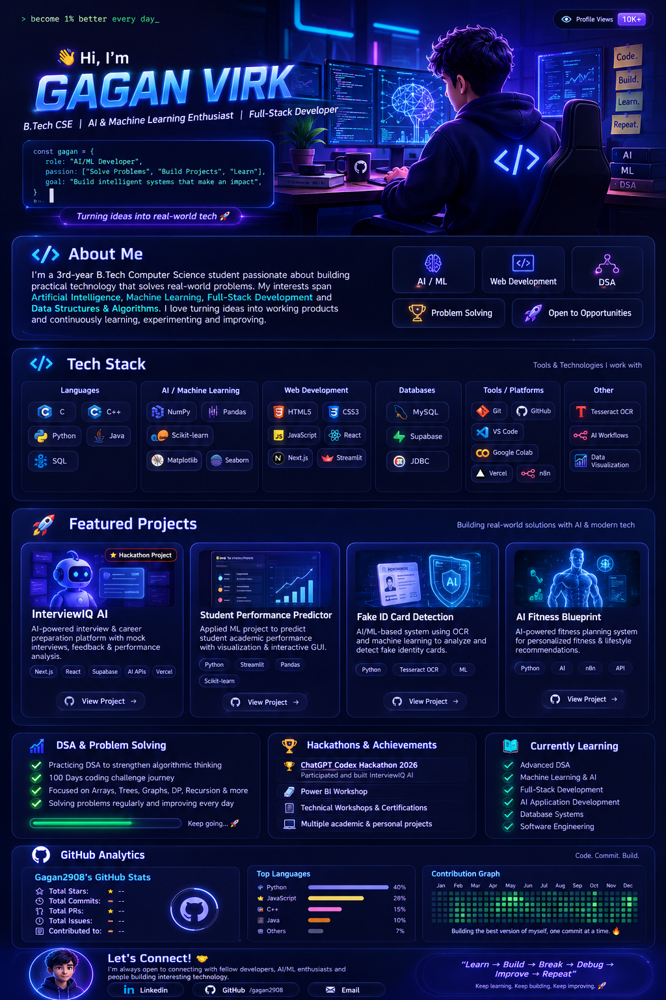

<div align="center">



<br><br>


<br><br>

<a href="https://github.com/gagan2908">

</a>

<a href="LINKEDIN_PROFILE_URL">

</a>

<a href="mailto:virkgagan1322@gmail.com">

</a>

<br><br>


</div>

---

# 👋 About Me

Hi, I'm **Gaganpreet Singh**, a **3rd-year B.Tech Computer Science Engineering student** with a strong interest in **Artificial Intelligence, Machine Learning, software development, Data Structures & Algorithms, and building practical technology solutions**.

I enjoy taking an idea from **concept → development → testing → deployment**, while continuously improving my programming, problem-solving, and software engineering skills.

My learning journey combines:

* 🤖 Artificial Intelligence & Machine Learning
* 💻 Software & Full-Stack Development
* 🧠 Data Structures & Algorithms
* 🗄️ Databases & Backend Technologies
* 🔐 Computer Science fundamentals
* 🚀 Hackathons & real-world projects
* 🔧 AI-powered workflows and applications

I'm especially interested in building applications where **AI, software engineering, and practical problem solving come together**.

---

# ⚡ Quick Profile

<div align="center">

<table>
<tr>

<td align="center" width="180">
<h2>🎓</h2>
<b>3rd Year</b>
<br>
B.Tech CSE
</td>

<td align="center" width="180">
<h2>🤖</h2>
<b>AI / ML</b>
<br>
Enthusiast
</td>

<td align="center" width="180">
<h2>💻</h2>
<b>Developer</b>
<br>
Builder
</td>

<td align="center" width="180">
<h2>🧠</h2>
<b>DSA</b>
<br>
Problem Solver
</td>

<td align="center" width="180">
<h2>🚀</h2>
<b>Continuous</b>
<br>
Learner
</td>

</tr>
</table>

</div>

---

# 🛠️ Technical Skills

## 👨‍💻 Programming Languages

<div align="center">


<br><br>


</div>

### Areas of Practice

* C / C++ programming
* Python development
* Java & Object-Oriented Programming
* JavaScript
* SQL
* Algorithmic problem solving

---

# 🤖 Artificial Intelligence & Machine Learning

My AI/ML learning and project experience includes:

### Machine Learning

* Supervised Learning
* Unsupervised Learning
* Regression
* Classification
* Clustering
* Logistic Regression
* Naive Bayes
* K-Means Clustering
* Feature Scaling
* Data Preprocessing
* Missing Data Handling
* Model Evaluation
* Cross-Validation
* Regularization
* Bias-Variance Tradeoff
* Gradient Descent
* Loss Functions
* Optimization Fundamentals

### Machine Learning Libraries

<div align="center">


</div>

---

# 🌐 Web & Application Development

<div align="center">


<br><br>


</div>

### Development Experience

* HTML & CSS
* JavaScript
* React
* Next.js
* Streamlit
* Responsive interfaces
* API integration
* AI-powered web applications
* Full-stack application development
* Deployment-oriented development

---

# 🗄️ Databases & Backend

<div align="center">


<br><br>


</div>

### Experience & Learning

* SQL
* MySQL
* Supabase
* JDBC
* Database Management Systems
* Relational databases
* Database queries
* Backend data handling

---

# ⚙️ Tools & Platforms

<div align="center">


<br><br>


</div>

### Tools I Work With

* Git
* GitHub
* Visual Studio Code
* Google Colab
* Vercel
* n8n
* Tesseract OCR
* API-based development
* AI workflow automation

---

# 🚀 Featured Projects

## 🤖 InterviewIQ AI

### AI-Powered Interview & Career Preparation Platform

**InterviewIQ AI** is an AI-powered platform designed to help students and job seekers prepare more effectively for interviews.

The project focuses on providing a practical environment for interview preparation, performance analysis, and personalized feedback.

### Key Features

* 🎤 AI-powered mock interviews
* 🧠 Interview practice
* 📊 Performance analysis
* 💡 Personalized feedback
* 🎯 Career preparation
* 🌐 Modern web application
* 🚀 Deployed application

### Technology

`Next.js` `React` `Supabase` `AI APIs` `Vercel`

### Hackathon

Built and deployed during the **ChatGPT Codex Hackathon 2026**, organized by **BlockseBlock**.

---

## 📊 Student Performance Predictor

### Applied Machine Learning Project

A machine learning project focused on analyzing academic factors and predicting student performance through an interactive application.

### Key Features

* 📚 Academic performance prediction
* ✅ Pass / fail prediction
* 🧹 Data preprocessing
* 📊 Data visualization
* 🧠 Machine learning model
* 🖥️ Interactive GUI
* 📈 Academic data analysis

### Technology

`Python` `Streamlit` `Pandas` `NumPy` `Scikit-learn` `Matplotlib` `Seaborn`

---

## 🪪 Fake ID Card Detection System

### OCR + Machine Learning

An AI/ML-based project that combines **Optical Character Recognition and machine learning concepts** for analyzing identity-card information and assisting with fake ID detection.

### Key Components

* 🔍 OCR-based text extraction
* 📄 ID information analysis
* 🤖 Machine learning
* ⚙️ Automated processing
* 🧠 Data analysis

### Technology

`Python` `Tesseract OCR` `Machine Learning`

---

## 🏋️ AI Fitness Blueprint

### AI-Powered Personalized Planning

An AI-powered project exploring personalized fitness planning and automated AI workflows.

The project combines structured user inputs with AI-based processing to generate personalized recommendations.

### Key Components

* 🤖 AI-powered recommendations
* 🧩 Personalized planning
* ⚙️ Workflow automation
* 🔗 API integration
* 📋 Structured output generation

### Technology

`Python` `AI` `n8n` `APIs`

---

# 🧠 Data Structures & Algorithms

I actively practice **Data Structures & Algorithms** to strengthen algorithmic thinking, coding fundamentals, and problem-solving ability.

### 📌 Topics

<div align="center">

`Arrays`

`Strings`

`Linked Lists`

`Stacks`

`Queues`

`Circular Queues`

`Trees`

`Binary Trees`

`Recursion`

`Searching`

`Sorting`

`Hashing`

`Matrices`

`Graphs`

`Dynamic Programming`

</div>

### 🎯 Current DSA Focus

* Problem-solving patterns
* Time complexity
* Space complexity
* Efficient implementations
* Recursive thinking
* Tree-based problems
* Linked-list problems
* Array and matrix problems
* Algorithm optimization

### 🧩 Problem-Solving Philosophy

```text
Understand
    ↓
Implement
    ↓
Analyze
    ↓
Optimize
    ↓
Repeat
```

---

# 🟩 GitHub Contribution Journey

<div align="center">

### Building Consistency Through Code

<p>
My GitHub contribution activity reflects my journey of learning, experimenting, building projects, solving problems, and continuously improving.
</p>


<br><br>


<br><br>

<b>Code → Commit → Learn → Build → Contribute → Repeat</b>

</div>

### 📌 What this represents

* 💻 Coding activity
* 📚 Continuous learning
* 🚀 Project development
* 🔧 Repository work
* 🧠 Problem solving
* 🔄 Consistency over time

---

# 🏆 Hackathons & Achievements

## 🚀 ChatGPT Codex Hackathon 2026

### Organized by BlockseBlock

Participated in the **ChatGPT Codex Hackathon 2026** and successfully built and deployed **InterviewIQ AI**, an AI-powered interview and career preparation platform.

### Experience Highlights

* AI-assisted development
* Rapid prototyping
* Full-stack application development
* AI integration
* Product development
* Deployment
* Working under time constraints
* Turning an idea into a working product

### Recognition

🏅 **Certificate of Participation**

---

# 📜 Workshops & Certifications

My technical learning journey also includes participation in workshops and additional learning experiences.

### 🤖 AI Workshops

Participated in AI-focused workshops exploring:

* Artificial Intelligence
* AI-powered content creation
* Generative AI
* Practical AI applications

### 📊 Power BI Workshop

Participated in a Power BI workshop focused on:

* Data visualization
* Business intelligence
* Dashboard concepts
* Data-driven insights

### 📚 Continuous Learning

I continue to supplement academic learning with:

* Technical workshops
* Online learning
* Coding challenges
* Hackathons
* Personal projects
* Practical experimentation

---

# 📚 Computer Science Foundations

My academic and practical learning covers a broad range of Computer Science fundamentals.

| Area                            | Focus                                       |
| ------------------------------- | ------------------------------------------- |
| 🧠 Data Structures & Algorithms | Algorithms, complexity & problem solving    |
| 🤖 Applied Machine Learning     | Regression, classification & clustering     |
| 🗄️ Database Management Systems | SQL, relational databases & JDBC            |
| ☕ Object-Oriented Programming   | Java, classes, inheritance & polymorphism   |
| ⚙️ Software Engineering         | Development, testing & quality              |
| 🌐 Computer Networks            | Networking fundamentals & protocols         |
| 🔐 Cryptography                 | Classical & modern cryptography concepts    |
| 💻 Operating Systems            | OS concepts & fundamentals                  |
| 📐 Linear Algebra               | Mathematical foundations for computing & ML |
| 🧮 Discrete Mathematics         | Mathematical & logical foundations          |
| 🧪 Software Testing             | Testing techniques & quality concepts       |

---

# 🔐 Cybersecurity & Cryptography Learning

As part of my Computer Science coursework, I've explored foundational cybersecurity and cryptography concepts including:

* Classical cryptography
* Substitution ciphers
* Affine cipher
* Multiplicative cipher
* Cryptographic fundamentals
* Network security concepts
* Authentication concepts
* Data integrity concepts

---

# 🌐 Computer Networks Learning

My networking coursework and practice includes concepts such as:

* OSI Model
* TCP/IP concepts
* IP addressing
* Subnetting
* ARP
* RARP
* CRC
* Hamming Code
* Sliding Window Protocol
* Channel Allocation
* Ethernet
* IEEE 802.3
* IEEE 802.11

---

# ☕ Object-Oriented Programming

My Java/OOP learning includes:

* Classes & Objects
* Constructors
* Inheritance
* Method Overloading
* Method Overriding
* Interfaces
* Abstract Classes
* Packages
* Access Modifiers
* `static`
* `final`
* `super`
* Exception Handling
* Multithreading
* IO Streams
* JDBC
* Nested Classes

---

# 🧪 Software Engineering & Testing

Areas I've studied include:

* Software development processes
* Agile & Scrum
* Software testing
* Boundary Value Analysis
* Equivalence Class Testing
* Path Testing
* Risk Management
* Software Quality
* McCall's Quality Factors
* ISO 9000
* CMM
* Software reliability concepts

---

# 🌱 Currently Learning

<div align="center">

<table>
<tr>

<td align="center" width="220">
<h2>🧠</h2>
<b>Advanced DSA</b>
<br>
Algorithms & Problem Solving
</td>

<td align="center" width="220">
<h2>🤖</h2>
<b>AI / ML</b>
<br>
Intelligent Applications
</td>

<td align="center" width="220">
<h2>🌐</h2>
<b>Full Stack</b>
<br>
Modern Web Development
</td>

</tr>

<tr>

<td align="center" width="220">
<h2>🏗️</h2>
<b>Software Engineering</b>
<br>
Better System Design
</td>

<td align="center" width="220">
<h2>🗄️</h2>
<b>Databases</b>
<br>
Backend & Data Systems
</td>

<td align="center" width="220">
<h2>💡</h2>
<b>AI Applications</b>
<br>
Practical AI Products
</td>

</tr>
</table>

</div>

---

# 🎯 Goals

My current development goals are focused on becoming a stronger and more well-rounded software engineer.

### 💻 Technical Goals

* Strengthen DSA and algorithmic problem solving
* Build more production-oriented applications
* Improve full-stack development
* Deepen Machine Learning knowledge
* Explore advanced AI applications
* Improve database and backend skills
* Learn better software architecture
* Strengthen system design fundamentals
* Contribute to open-source projects

### 🚀 Personal Development

* Build consistently
* Participate in meaningful hackathons
* Learn from real-world projects
* Improve technical communication
* Collaborate with other developers
* Turn ideas into useful products

---

# 💡 My Development Philosophy

<div align="center">

## Learn → Build → Test → Debug → Improve → Repeat

<br>

> **I don't just want to learn technologies — I want to build with them.**

<br>

### Build something. Break something. Understand why. Make it better.

</div>

---

# 📂 What You'll Find on My GitHub

My GitHub is a growing collection of:

* 💻 Programming practice
* 🧠 DSA solutions
* 🤖 Machine Learning projects
* 🌐 Web applications
* 🗄️ Database projects
* 🧪 Academic projects
* 🚀 Hackathon projects
* 🔧 AI workflows
* 📚 Learning experiments
* 🛠️ Development utilities

As I learn, I build — and as I build, I learn.

---

# 🤝 Let's Connect

<div align="center">

### Interested in technology, AI, software development or building something interesting?

I'm always open to connecting with **developers, students, AI/ML enthusiasts, builders, and people working on interesting ideas.**

<br><br>

<a href="https://github.com/gagan2908">

</a>

<a href="https://www.linkedin.com/in/gagan-virk2006?utm_source=share_via&utm_content=profile&utm_medium=member_ios">

</a>

<a href="mailto:virkgagan1322@gmail.com">

</a>

<br><br>

### 💫 Code. Learn. Build. Repeat. 🚀

</div>

---

<div align="center">


</div>
